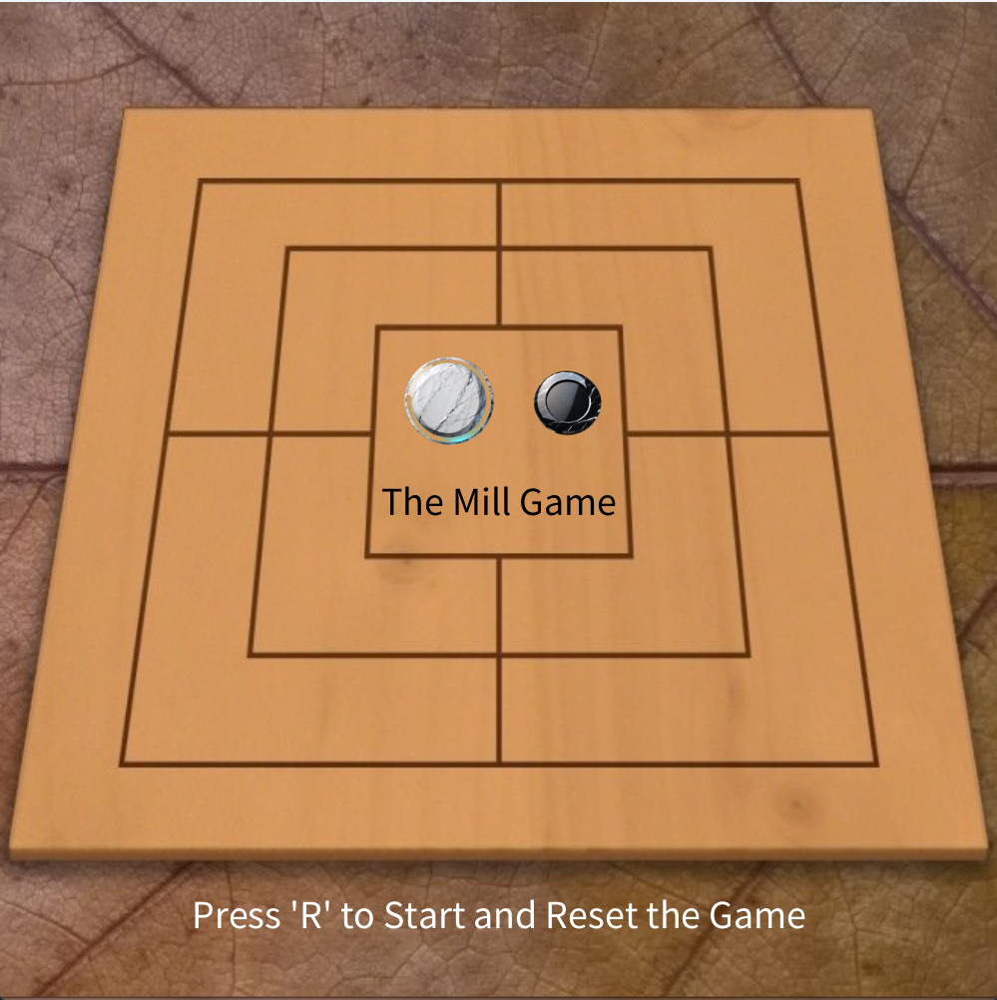
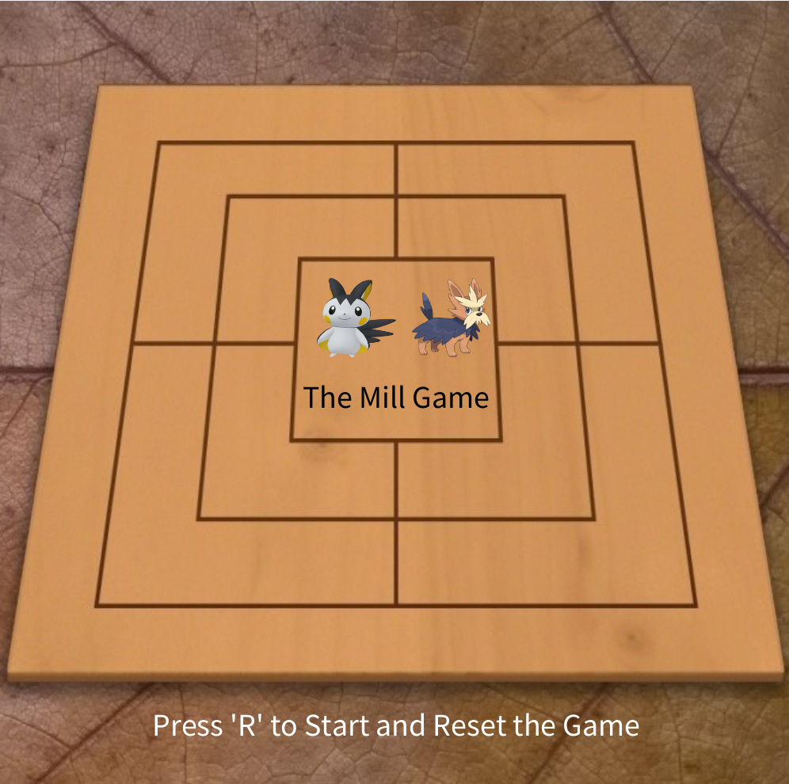
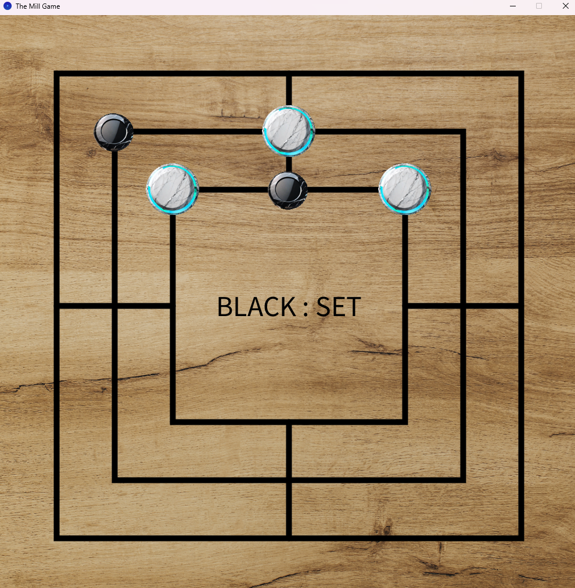
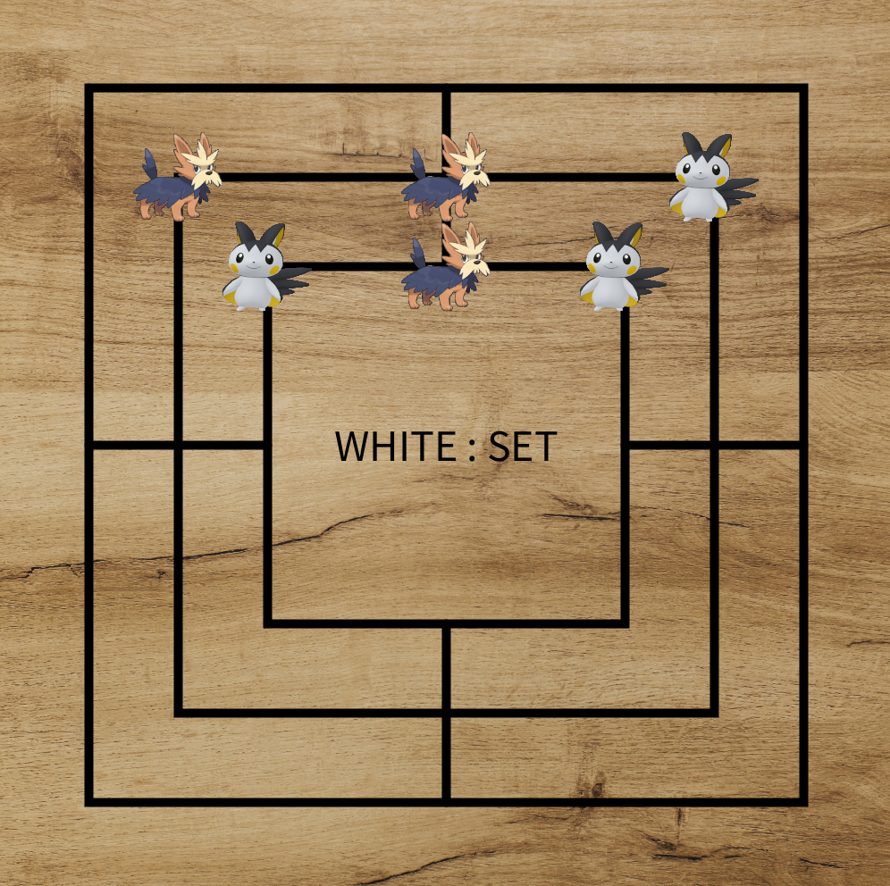
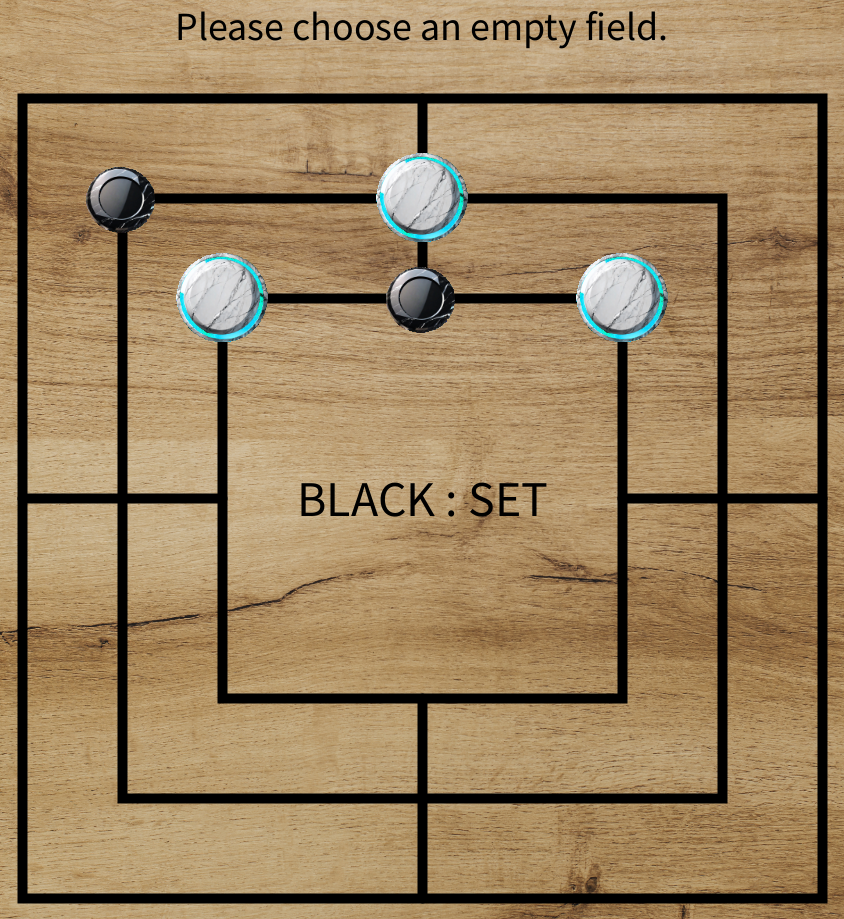
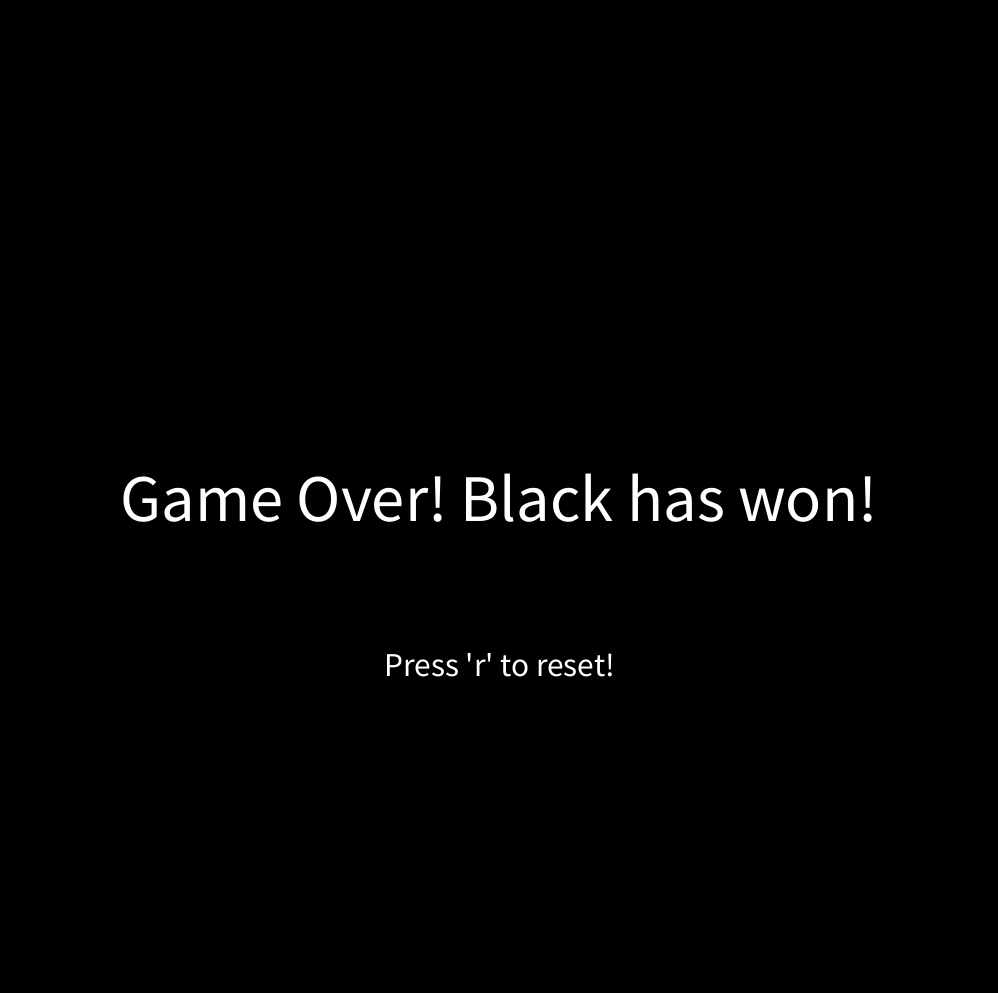

# Mühle

## Anleitung

Mit dieser Anwendung können Sie gemeinsam mit einem Freund das Spiel "Mühle" lokal spielen.

+ Spieler 1 hat die Farbe Weiß
+ Spieler 2 hat die Farbe Schwarz


### Die Setz Phase
Jeder Spieler ist am Anfang in der __SETZ__ Phase.
Die Spieler verlassen die Phase erst, wenn von jedem Spieler __neun__ Spielsteine gesetzt wurden.

### Die Stehl Phase
Die Phase kann sich dennoch zwischendurch ändern, in dem ein Spieler bereits in der Setz,Zieh oder Spring Phase eine Mühle generiert hat.
Wenn das der Fall ist, ist der Spieler mit der Mühle in einer __STEHL__ Phase.
Dieser kann nun einen Stein des gegners stehlen.


### Die Zieh Phase
Wenn alle neun Steine beider Spieler gesetzt wurden, dann sind beide Spieler in einer __ZIEH__ Phase.
Der Nutzer kann nun ein Stein seiner Farbe mit Drag and Drop auf ein anderes Feld verschieben.
Dabei ist es wichtig, dass beide Felder immer benachbart sind.


### Die Spring Phase
Sollte einer der Spieler nur noch __DREI__ Steine auf dem Feld besitzen, so ist dieser in einer __SPRING__
Phase.
Der Spieler kann nun seine Steine bewegen, ohne darauf achten zu müssen, ob die Felder benachbart sind.
Der Spieler hat freie Wahl an Feldern.


### Nutzerinformationen

Sie finden alle Fehler des Spiels auf der visuellen Oberfläche.

Sollte beispielsweise in der __SETZ__ Phase kein Feld ausgewählt werden, bekommt der Nutzer eine entprechenden hinweis.

Das Spiel kann jederzeit mit dem einem Tastendruck auf 'r' neugestartet werden.


## Jshell

### Mit diesem Abschnitt der Anleitung, können Sie die Anwendung auch in der JShell starten.

Navigieren Sie in den Ordner:

````shell
cd .\Model_Jshell
````

Öffnen Sie die JShell Anwendung in diesem Ordner und öffnen Sie alle Model Dateien:

````shell
JShell  .\PlayerTurn.java .\GameState.java .\Model.java
````

zunächst erstellen Sie ein neues Model in der JShell:

```console
var game = new Model()
```

erstellen Sie ein neues Spiel mit:

```console
game.newGame()
```

rufen Sie den aktuellen Stand des Spiels mit der variable auf:

```console
game
```

setzen Sie einen Spieler mit:

```console
game.setPlayer(0)
```` 
um Spieler 1 auf die Stelle (0) zu setzen.

wenn Sie sich in einer Zieh Phase befinden, bewegen Sie sich mit:

```console
game.move(8,9)
````

befinden Sie sich in einer Spring Phase, Springen Sie mit:

```console
game.move(8,0)
````


## Starten des Spiels

Um das Spiel auszuführen, muss die Main.java in dem dazugehörigen Package ausgeführt werden.
+ ``Main.Main``
Sie können das Spiel auch mit Pokemon Spielen indem Sie folgendes Starten.
+ `Main.MainPokemon`
lässt Sie das spiel mit zwei Spielern (Schwarz & Weiß) spielen.
Mit den Instruktionen auf dem Startbildschirm lässt sich das Spiel ganz einfach starten.


## Startbildschirm

<h5> mit Spielsteinen </h5>



<h5> mit Pokemon </h5>



## Spielscreen

<h5> mit Spielsteinen </h5>



<h5> mit Pokemon </h5>



## Auskunft über mögliche Fehler



<p>hier wurde kein valides Feld für Schwarz ausgewählt.</p>

## Game Over Screen




## Verwendete Bibliotheken

- [Processing PApplet](https://processing.github.io/processing-javadocs/core/processing/core/PApplet.html)

- [Processing PImage](https://processing.github.io/processing-javadocs/core/processing/core/PImage.html)

- [JUnit](https://junit.org/junit5/)

- [Arrays](https://docs.oracle.com/javase/7/docs/api/java/util/Arrays.html)


## Quellen des Projekts

- [Spielsteine](https://hotpot.ai/art-generator)

- [Pokemon Herdier](https://www.stickpng.com/de/img/tiere/die-unglaublichen/herdier-pokemon)

- [Pokemon Emolga](https://www.stickpng.com/de/img/comics-und-fantasy/verschiedene-comics/emolga-pokemon)

- [Hintergrundbild](https://wallpaperaccess.com/mill)

- [Processing Referenz](https://processing.org/)

- [Error bearbeitung](https://rollbar.com/blog/java-exceptions-hierarchy-explained/)

- [Spielhintergrund](https://www.freepik.com/free-photo/natural-wooden-background_5505940.htm#query=board%20background%20wood&position=1&from_view=search&track=ais&uuid=ff5c71bf-5973-444f-b08a-d666bff239ac)
